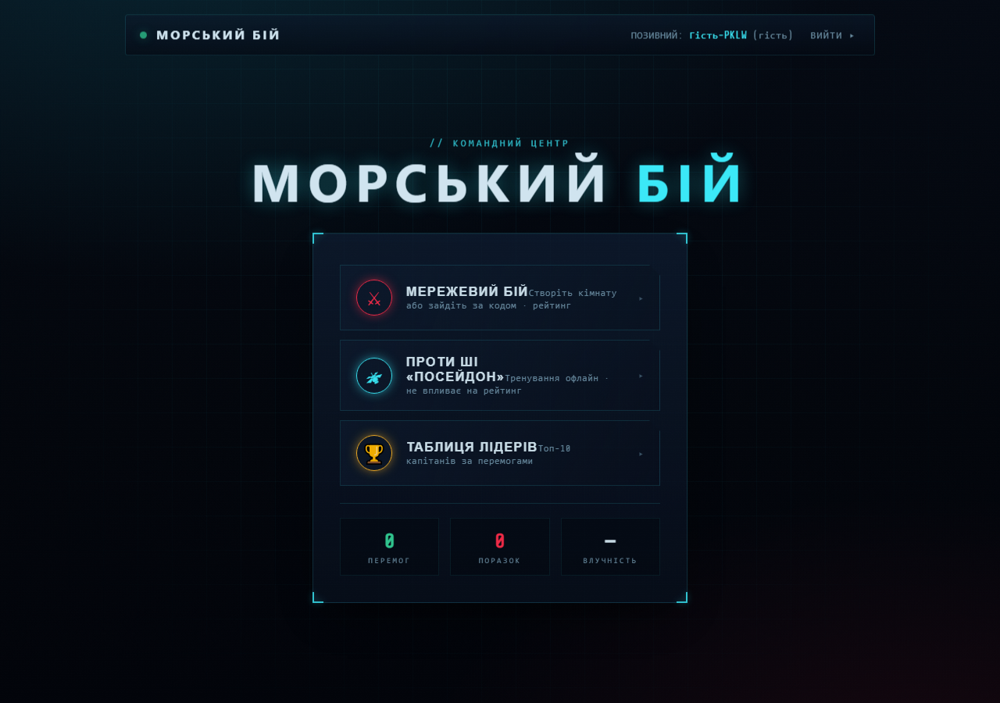
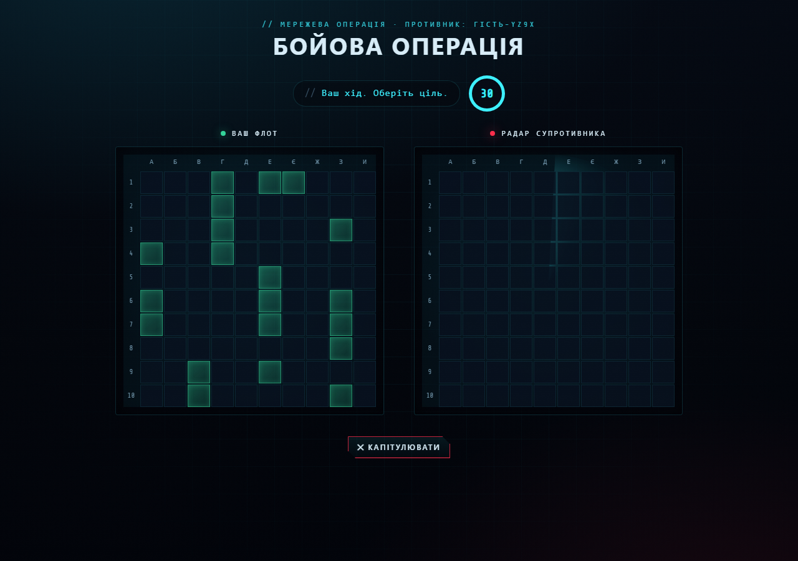

# ⚓ Морський Бій — Naval Command

Модернізований full-stack «Морський бій»: грайте онлайн у двох вкладках на `localhost`
або тренуйтеся проти ШІ. Авторитарний сервер, нормальна авторизація на JWT + SQLite,
і повністю новий тактичний інтерфейс **Naval Command HUD**.




---

## 📦 Стек і за рахунок чого це працює

| Шар | Технологія | За що відповідає / чому саме це |
|---|---|---|
| **Фронтенд** | **React 18 + Vite 6** | Компонентний UI, JSX-збірка, миттєвий HMR у розробці. Замінили старий підхід «React+Babel через CDN у браузері» (повільний, не для проду). |
| **Реалтайм** | **Socket.io 4** | Двосторонній звʼязок: кімнати, ходи, постріли, серверний таймер, дисконекти. |
| **Бекенд** | **Node.js + Express 4** | REST API (авторизація, лідерборд) + роздача зібраного клієнта. |
| **База даних** | **SQLite через вбудований `node:sqlite`** | Зберігання користувачів і статистики. Вбудований у Node 24 синхронний драйвер — **без нативної збірки** і без зайвих залежностей. |
| **Авторизація** | **`jsonwebtoken` + `bcryptjs`** | Підписаний JWT-токен → захищені REST і WebSocket; паролі хешуються bcrypt. |
| **Тести** | **Vitest + Playwright** | Юніт-тести правил, інтеграційні тести сервера, браузерний E2E «двох вкладок». |
| **Монорепо** | **npm workspaces + concurrently** | Один `npm install`, один `npm run dev` піднімає і сервер, і фронт. |

**Ключова ідея архітектури — авторитарний сервер.** У старій версії сервер лише
пересилав постріли, а кожен клієнт «судив» власне поле — це легко зламати читами. Тепер
**сервер зберігає обидва поля, перевіряє кожен постріл, веде чергу ходів і вирішує
переможця**. Клієнт нічого не вирішує — лише показує те, що підтвердив сервер.

---

## ✨ Можливості

- 🔐 **Реєстрація / вхід** з хешуванням паролів і JWT-сесією (зберігається між перезавантаженнями).
- 👥 **Гостьовий вхід** одним кліком — щоб одразу зайти у 2-й вкладці без реєстрації.
- ⚔️ **Мережева гра**: створення кімнати з кодом і приєднання за кодом.
- 🛰️ **Гра проти ШІ** «Посейдон» (офлайн, з «мисливським» алгоритмом добивання).
- 🧭 **Ручна або випадкова розстановка** флоту з прев'ю та забороною дотику кораблів.
- ⏱️ **Серверний таймер ходу** (30 с) з автопередачею ходу.
- 🏆 **Таблиця лідерів** (топ-10 за перемогами).
- 📊 **Статистика** перемог/поразок (оновлюється лише за результатами чесних онлайн-матчів).

---

## 🧱 Архітектура та потік даних

```
                 ┌──────────────────────── Браузер (вкладка) ────────────────────────┐
                 │  React (Vite)                                                      │
                 │  ├─ AuthContext (JWT у localStorage)                               │
                 │  ├─ REST  ──────────────►  /api/*        (реєстрація, вхід, топ-10) │
                 │  └─ Socket.io ──────────►  /socket.io    (вся ігрова логіка)        │
                 └────────────────────────────────┬───────────────────────────────────┘
                                                  │  (Vite проксіює обидва на :3000)
                 ┌────────────────────────────────▼───────────────────────────────────┐
                 │  Node.js сервер (:3000)                                              │
                 │  ├─ Express: /api/auth/*, /api/leaderboard   (JWT + bcrypt)          │
                 │  ├─ Socket.io: io.use(JWT) → RoomManager     (АВТОРИТЕТ)             │
                 │  │     стани кімнати: waiting → placement → battle → finished        │
                 │  └─ node:sqlite (game.db): users(wins, losses)                       │
                 └────────────────────────────────┬───────────────────────────────────┘
                                                  │ імпортує
                 ┌────────────────────────────────▼───────────────────────────────────┐
                 │  shared/engine.js — ЧИСТІ правила (без залежностей)                  │
                 │  створення поля · валідація флоту · постріл · потоплення · перемога  │
                 │  Той самий код використовує і сервер (онлайн), і клієнт (бот).       │
                 └──────────────────────────────────────────────────────────────────────┘
```

- **REST** — лише авторизація та лідерборд (запит/відповідь).
- **Socket.io** — уся ігрова взаємодія в реальному часі.
- **`shared/engine.js`** — єдине джерело правил, щоб логіка сервера й бота не розходилась.

### Авторитарний онлайн-матч (стейт-машина кімнати)

1. **waiting** — гравець 1 створює кімнату, сервер видає 4-символьний код, чекаємо суперника.
2. **placement** — обидва зайшли; кожен розставляє флот у UI і надсилає **повний флот**
   на сервер. Сервер перевіряє легальність (`validateFleet`: правильні розміри, без
   дотику/перетину, у межах поля) і зберігає поле у себе.
3. **battle** — сервер призначає черговість. На постріл `fire {r,c}` сервер перевіряє,
   чий хід і чи не стріляли сюди, рахує результат по **своїй** копії поля суперника й
   розсилає його обом. Влучив → ходиш ще; промах → хід переходить.
4. **finished** — щойно 20 клітин чийогось флоту збито, сервер оголошує переможця,
   **сам оновлює статистику** обох гравців у БД і прибирає кімнату.

**Таймер ходу — серверний.** Сервер надсилає дедлайн (`turn:start {deadline}`); клієнт
лише показує відлік. По таймауту сервер сам передає хід (`turn:timeout`).

### Події Socket.io (контракт)

| Напрям | Подія | Призначення |
|---|---|---|
| C→S | `room:create` / `room:join {code}` | створити / зайти в кімнату |
| C→S | `fleet:submit {ships}` | надіслати розставлений флот |
| C→S | `fire {r,c}` / `room:leave` | постріл / вихід |
| S→C | `room:created {code}` / `match:placement {playerNum, opponent}` | кімнату створено / починаємо розстановку |
| S→C | `fleet:accepted` / `opponent:ready` / `match:battle {yourTurn}` | флот прийнято / суперник готовий / старт бою |
| S→C | `turn:start {playerNum, deadline}` / `turn:timeout {playerNum}` | початок ходу / таймаут |
| S→C | `shot:result {…}` / `shot:incoming {…}` | результат вашого пострілу / постріл по вас |
| S→C | `game:over {win, reason}` / `opponent:left` / `*:error {message}` | кінець / суперник вийшов / помилка |

### Гра проти ШІ

Повністю офлайн на клієнті (та сама `shared/engine.js`). Бот спершу стріляє по «шаховому»
патерну, а після влучання переходить у режим добивання сусідніх клітин. **Це тренування —
воно не впливає на серверний рейтинг** (статистику оновлюють лише чесні онлайн-матчі).

---

## 🔐 Як працює авторизація

- `POST /api/auth/register` — валідація, `bcrypt`-хеш пароля, запис у `users`.
- `POST /api/auth/login` — перевірка пароля, видача **JWT** (термін 7 днів) + профілю.
- `POST /api/auth/guest` — тимчасовий JWT із випадковим імʼям (не зберігається в БД, поза рейтингом).
- `GET /api/auth/me` — поточний профіль (потрібен Bearer-токен).
- `GET /api/leaderboard` — топ-10 (публічно).
- **Немає** публічного ендпойнта оновлення статистики — її змінює лише сервер за
  результатом авторитарного матчу. Тож підробити перемоги не можна.
- Токен зберігається в `localStorage` і додається в `Authorization: Bearer …` (REST) та в
  `auth.token` рукостискання сокета. Сокет без валідного токена відхиляється.

---

## 🗂️ Структура проєкту

```
Battleship/
├── package.json            # workspaces + скрипти (dev / build / start / test)
├── shared/
│   └── engine.js           # ЧИСТІ правила гри (дошка, валідація, постріл, перемога)
├── server/
│   ├── index.js            # bootstrap Express + Socket.io (+ фабрика для тестів)
│   ├── app.js              # Express-застосунок: маршрути, роздача клієнта
│   ├── auth.js             # /register /login /guest /me + JWT-middleware
│   ├── rooms.js            # авторитарний матч-менеджер (стейт-машина, таймери)
│   ├── socket.js           # JWT-автентифікація сокета + підключення подій
│   ├── db.js               # node:sqlite — таблиця users і запити
│   └── silence.js          # глушить технічне попередження node:sqlite
├── client/
│   ├── index.html          # підключення шрифтів (Chakra Petch, Share Tech Mono)
│   ├── vite.config.js      # проксі /api та /socket.io на :3000
│   └── src/
│       ├── main.jsx, App.jsx          # вхід + маршрутизація екранів
│       ├── api.js, socket.js          # REST-клієнт і фабрика сокета
│       ├── context/AuthContext.jsx    # стан авторизації (токен + профіль)
│       ├── hooks/useBotGame.js        # офлайн-матч проти ШІ
│       ├── hooks/useOnlineGame.js     # онлайн-матч через сокет
│       ├── lib/marks.js               # нанесення пострілів на поле
│       ├── components/                # Board, GameView, HudFrame, TurnTimer, …
│       ├── screens/                   # Auth, Menu, Lobby, Game, Leaderboard
│       └── styles/                    # tokens + компоненти (Naval Command HUD)
├── tests/                  # engine.test.js, server.test.js (Vitest) + e2e.mjs (Playwright)
└── docs/                   # спека дизайну + скриншоти
```

---

## 🚀 Запуск (локально)

**Вимоги:** Node.js **24+** (через вбудований `node:sqlite`) і npm.

```bash
# 1. Встановити всі залежності (одразу для shared/server/client)
npm install

# 2. Режим розробки: Node-сервер (:3000) + Vite (:5173) одночасно
npm run dev
#  → відкрийте http://localhost:5173
```

Для «продакшн»-режиму (один сервер роздає зібраний клієнт):

```bash
npm run build      # збірка клієнта у client/dist
npm start          # сервер роздає все на http://localhost:3000
```

> 💡 На localhost усе працює без налаштувань. За бажанням можна задати `JWT_SECRET`
> (див. `.env.example`).

---

## 🎮 Як грати у 2 вкладки

1. Запустіть `npm run dev` і відкрийте **http://localhost:5173** у **двох вкладках**.
2. У кожній вкладці натисніть **«швидкий вхід як гість»** (або зареєструйте два акаунти).
3. **Вкладка 1:** «Мережевий бій» → «Створити кімнату» → зʼявиться **код** (напр. `MSQJ`).
4. **Вкладка 2:** «Мережевий бій» → введіть цей код → «Увійти в бій».
5. В обох вкладках розставте флот (**«випадково»** для швидкого старту) → **«до бою»**.
6. Коли обидва готові — починається бій. Стріляйте по радару суперника у свій хід. 🚢💥

---

## 🧪 Тести

```bash
npm test              # Vitest: 18 тестів правил + 6 інтеграційних (auth + матч)
```

Браузерний E2E «двох вкладок» (потрібен запущений сервер):

```bash
npm run build && npm start      # у першому терміналі
node tests/e2e.mjs              # у другому — проганяє реальний матч у Chromium
```

E2E відкриває дві незалежні сесії, проходить вхід → створення кімнати → приєднання →
розстановку → бій → постріл і робить скриншоти у `tests/screenshots/`.

---

## 🔒 Безпека (для localhost-демо)

- Паролі **хешуються** (bcrypt), у БД лежить лише хеш.
- Серверна логіка — **авторитет**: розстановку й постріли не підробити з клієнта.
- Статистику змінює лише сервер за результатом матчу.
- ⚠️ Для localhost використовується дефолтний `JWT_SECRET` (сервер про це попереджає).
  Перед будь-яким публічним розгортанням задайте власний секрет.

---

## 🛣️ Можливі покращення (поза обсягом)

Реконект у матч після обриву звʼязку, рейтинг/ELO, історія матчів, чат у кімнаті,
розгортання за межі localhost (HTTPS, секрети, домен).

---

## 📄 Ліцензія

MIT
